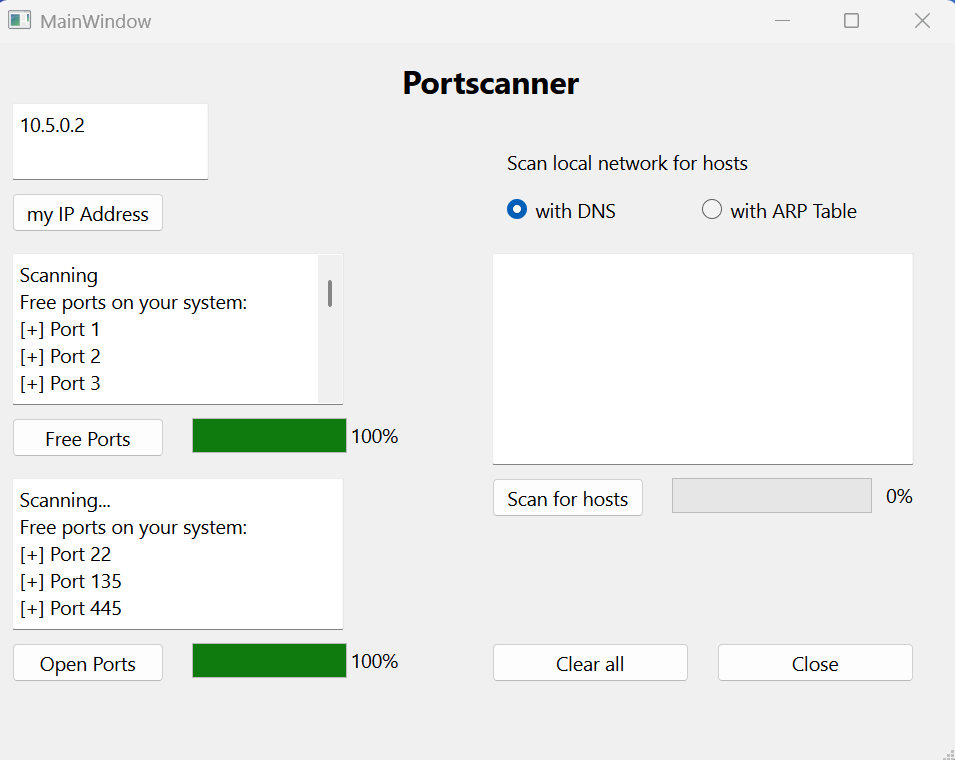

# 2025_Portscanner_Python
A local Network Portscanner in Python

Current status

License / Lizenz

English:
This software is for private, non-commercial use only.
Any commercial use, modification, distribution, or publication without prior written permission is prohibited.
See LICENSE.txt for details.

Deutsch:
Diese Software darf nur privat und nicht kommerziell verwendet werden.
Kommerzielle Nutzung, Modifikation oder Weitergabe ist ohne schriftliche Erlaubnis nicht gestattet.
Details siehe LICENSE.txt.
✉️ Contact / Kontakt

Fragen, Feedback oder Interesse an einer Lizenz für kommerzielle Nutzung?

📧 E-Mail: martin.tastler@posteo.de
Status
